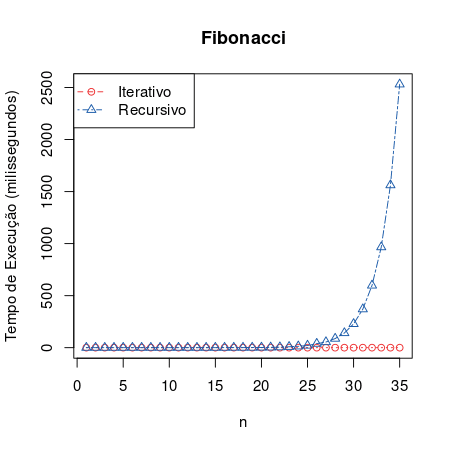

Title: Questões para estudo de algoritmos
Slug: questoes-para-estudo-de-algoritmos
Date: 2022-10-17 15:00
Category: Python
Tags: python, performance
Author: Eduardo Klosowski
Email: eduardo_klosowski@yahoo.com
Github: eduardoklosowski
Twitter: eduklosowski
Site: https://dev.to/eduardoklosowski
About_author: Mestre em computação aplicada, programador backend com conhecimento de DevOps

(teste1)Recentemente li o texto do Maycon Alves, ["3 algoritmos para você sua lógica"](https://mayconbalves.com.br/3-algoritmos-para-voc%C3%AA-sua-l%C3%B3gica/), onde são apresentados 3 problemas para treinar a lógica e escrita de algoritmos: [cálculo de fatorial](https://pt.wikipedia.org/wiki/Fatorial), [identificar se um número é primo](https://pt.wikipedia.org/wiki/N%C3%BAmero_primo), e [calcular os valores da sequência de Fibonacci](https://pt.wikipedia.org/wiki/Sequ%C3%AAncia_de_Fibonacci). São problemas interessantes, e após resolvê-los, pode-se fazer outras perguntas que levam a um entendimento mais profundo desses algoritmos. Eu recomendo que leiam o texto do Maycon primeiro e tentem implementar uma solução para esses problemas propostos, e com isso feito, vamos discutir um pouco sobre eles.

## Analisando as soluções

No texto do Maycon, tem uma dica sobre o problema da sequência de Fibonacci, onde é dito que ele pode ser resolvido usando recursividade ou *loops*. Vamos analisar essas opções.

Uma solução recursiva pode ser implementada como a baixo. O código dessa solução é simples e se aproxima bastante da descrição matemática do problema.

```python
def fibonacci(n):
    if n <= 1:
        return n
    return fibonacci(n - 2) + fibonacci(n - 1)
```

Enquanto uma solução iterativa (com *loop*) pode ser um pouco mais complicada de se ler:

```python
def fibonacci(n):
    a = 0
    b = 1
    for i in range(n - 1):
        a, b = b, a + b
    return b
```

Essas mesmas técnicas podem ser utilizadas para resolver o cálculo do fatorial. Onde uma implementação recursiva e outra iterativa podem ser vistas a baixo:

```python
def fatorial(n):
    if n <= 1:
        return 1
    return n * fatorial(n - 1)
```

```python
def fatorial(n):
    valor = 0
    for i in range(1, n + 1):
        valor *= i
    return valor
```

Com essas soluções implementadas, vem uma pergunta: Existe alguma diferença entre elas, além da diferença de como isso está expresso no código? Um primeiro teste que pode ser feito é de desempenho visando observar quanto tempo cada implementação leva para calcular a resposta. Os testes foram executados em um notebook com processador Intel Core i7-6500U CPU @ 2.50GHz, memória RAM DDR4 2133MHz, no Python 3.9.2 do Debian 11, desativamente o *garbage collector* do Python durante a execução das funções para ter um resultado com menos variação, apresentados como uma média de 10 execuções ([código utilizado](https://github.com/eduardoklosowski/blog/tree/main/content/2022-10-17-questoes-para-estudo-de-algoritmos)).

O gráfico a baixo mostra o tempo de execução das implementações que calculam os valores da sequência de Fibonacci, onde é possível observar que a implementação iterativa mantém uma linearidade do tempo conforme vai se pedindo números maiores da sequência, diferente da implementação recursiva, que a cada valor quase dobra o tempo de execução.



E a baixo pode-se observar o gráfico para as implementações que calculam o fatorial, que devido aos tempos serem mais baixos, possui uma variação um pouco maior, e é possível observar uma tendência de reta para as duas implementações, com a implementação recursiva tendo um ângulo um pouco mais íngreme, implicando em um algoritmo mais lento.


A partir desses dois gráficos algumas perguntas podem ser feitas: Por que a implementação recursiva do Fibonacci apresentou uma curva que se aproxima de uma exponencial e não de uma reta como as demais? Qual a diferença para a implementação recursiva do fatorial que explicar isso? Implementações recursivas são sempre piores que as implementações iterativas, ou existem casos em elas superem ou se equivalem as iterativas?

Saindo um pouco desses gráficos, outras questões podem ser levantadas, como: Existe mais algum aspecto ou característica além do tempo de execução (e facilidade de leitura do código) para a escolha entre uma implementação ou outra? Considerando que essas funções vão rodar em um servidor, existe alguma coisa que possa ser feita para melhorar a performance dessas funções, como reaproveitar resultados já calculados para se calcular novos resultados? Como isso poderia ser feito? Quais são as desvantagens dessa abordagem?

Olhando para o problema de verificar se um número é primo, existe o [crivo de Eratóstenes](https://pt.wikipedia.org/wiki/Crivo_de_Erat%C3%B3stenes), ele é uma implementação eficiente? Existem casos em que ele pode ser uma boa solução ou não? O exemplo a baixo (retirado da Wikipédia) mostra o processo para encontrar todos os números primos até 120, existe alguma forma de adaptá-lo para executar diversas vezes reaproveitando o que já foi calculado, como sempre retornar o próximo número primo?


## Considerações

Se você nunca se deparou com perguntas desse tipo, seja bem-vindo a área de análise de algoritmos, onde após se ter uma solução, busca-se analisar e descrever o comportamento do algoritmo, e até a busca de algoritmos mais eficientes. E trazendo para o dia a dia de um desenvolvedor, essas questões podem ser a resposta do motivo do código funcionar muito bem no computador de quem desenvolveu, mas demorar muito ou apresentar problemas para rodar no servidor de produção, ou com o tempo (e crescimento do volume de dados) começar a dar problemas.

Nesse artigo eu apenas levantei as perguntas, deixo que cada um busque as respostas, que existem. Sintam-se livres para me procurar para discutir alguma questão ou orientações para encontrar as respostas, seja nos comentários do texto no [dev.to](https://dev.to/eduardoklosowski/questoes-para-estudo-de-algoritmos-5dab) ou no [Twitter](https://twitter.com/eduklosowski).

---

Esse artigo foi publicado originalmente no [meu blog](https://eduardoklosowski.github.io/blog/), passe por lá, ou siga-me no [DEV](https://dev.to/eduardoklosowski) para ver mais artigos que eu escrevi.
